<div align="center">


<sub>a.k.a. <b>Zen1x</b></sub>

<br/>

<a href="https://salxh.dev"></a>
<a href="https://zentr1x.team"></a>
<a href="https://linkedin.com/in/salehabusaleh"></a>
<a href="https://tedx.zu.edu.jo"></a>

<br/><br/>


</div>

<br/>


##  About Me

```ts
const saleh: Engineer = {
  role: ["Founder &amp; Lead Developer @ ZenTr1x", "Technical Director @ TEDx Zarqa University", "Technical Director @ GDG HU"],
  focus: "Enterprise-grade web applications &amp; ERP systems",
  philosophy: "I build products, not tutorials.",
  stack: {
    backend: ["ASP.NET Core", ".NET", "Node.js", "Prisma", "Clean Architecture", "CQRS", "Microservices"],
    frontend: ["Next.js", "React", "Angular", "TypeScript", "Tailwind CSS"],
    data: ["PostgreSQL", "SQL Server", "Redis"],
    ai: ["OpenAI", "Gemini", "LangChain", "RAG", "Vector DBs"],
  },
  currentlyBuilding: "Production ERP systems for real businesses — inventory, sales, accounting, analytics",
};
```

I design and ship full-stack systems end-to-end — from database schema to pixel-perfect, RTL-ready interfaces. My work centers on **distributed, scalable architecture** for real operational businesses: warehouses, factories, and enterprise teams that need software they can actually run on.

<br/>


##  Tech Stack

<div align="center">



<sub>Core stack in the inner orbit, supporting tools and platforms in the outer orbit — lines draw in, nodes drift gently, satellites keep circling.</sub>

</div>

<details>
<summary><b>Full stack, in text</b></summary>
<br/>

**Backend &amp; Architecture** — ASP.NET Core, .NET, Node.js, Prisma, SignalR, JWT, CQRS, MediatR, Microservices
<br/>
**Frontend** — Next.js, React, Angular, TypeScript, Tailwind CSS, Framer Motion
<br/>
**Database &amp; Cloud** — PostgreSQL, SQL Server, SQLite, Redis, Azure, Vercel, Docker, GitHub Actions, Cloudinary
<br/>
**AI &amp; Data** — OpenAI, Gemini, LangChain, RAG, Vector Databases

</details>

<br/>


##  Featured Projects

<br/>

<table width="100%">
<tr><td>

### 🧩 GDG HU Workspace
**Enterprise Collaboration Platform**

An internal enterprise-grade platform built for Google Developer Group HU — 13+ integrated modules covering team collaboration, task management, and organizational analytics.

**Highlights**
- Full RBAC (role-based access control) across all modules
- Kanban-based project &amp; task workflows
- Real-time analytics dashboards
- In-app notification system

`Next.js 15` · `PostgreSQL` · `Prisma` · `Tailwind CSS` · `JWT` · `Argon2`

  

</td></tr>
<tr><td>

### 🎤 TEDx Zarqa University
**Official Conference Website**

The official, publicly live website for TEDx Zarqa University — built as a fully serverless application with a modern, animated interface designed to represent the event's brand.

**Highlights**
- Fully serverless deployment
- Smooth, purposeful motion design
- Cloudinary-powered media pipeline

`Next.js` · `PostgreSQL` · `Prisma` · `Cloudinary` · `Animations`

 <a href="https://tedx.zu.edu.jo"></a>

</td></tr>
<tr><td>

### ⚡ Electrical Warehouse ERP
**Production-Grade Warehouse Management System**

A full enterprise ERP built for electrical warehouses — covering inventory, purchasing, sales, accounting, and multi-warehouse operations end-to-end.

**Highlights**
- Barcode &amp; QR-based inventory scanning
- Warehouse transfers with full stock ledger auditing
- Profit analysis and operational reporting
- Mobile-first, RTL-ready interface for floor use

`Next.js` · `TypeScript` · `PostgreSQL` · `Prisma` · `Tailwind CSS` · `Serverless` · `Barcode/QR`

  

</td></tr>
<tr><td>

### 🍰 Fudge &amp; Co ERP
**Enterprise ERP for a Cake &amp; Bakery Factory**

A complete production-to-sale ERP built for a real bakery manufacturing business, spanning the full operational cycle from raw ingredients to customer delivery.

**Highlights**
- Recipe &amp; ingredient-driven production management
- Purchase orders, sales, and cost/profit analysis
- Barcode/QR-integrated warehouse tracking
- Employee management and analytics dashboard

`Next.js` · `TypeScript` · `Prisma` · `PostgreSQL` · `Tailwind CSS` · `Serverless`

 

</td></tr>
<tr><td>

### 🤝 Athar AlT6w3
**Volunteer Platform**

A platform connecting volunteers with opportunities, built with secure authentication and cloud-based media handling.

`Serverless` · `JWT` · `Cloudinary`

<a href="https://athar-alt6w3.vercel.app/"></a>

</td></tr>
<tr><td>

### 💰 Floosy AI
**AI-Powered Financial Platform**

An AI financial assistant combining computer vision and geolocation to help users track and understand their spending.

**Achievement:** 🥉 3rd Place Winner

`Gemini Vision` · `Firebase` · `Maps API` · `AI`

 <a href="https://floosy-final.vercel.app/"></a>

</td></tr>
<tr><td>

### 🎓 SQLab
**Interactive SQL Learning Platform**

A hands-on platform for learning SQL through live, interactive query execution rather than static tutorials.


</td></tr>
</table>

<br/>


##  Professional Experience

<table width="100%">
<tr>
<td width="20%"><b>Founder &amp; Lead Developer</b><br/><sub>ZenTr1x</sub></td>
<td>Building and leading a development team delivering production-grade full-stack and enterprise software.</td>
</tr>
<tr>
<td width="20%"><b>Technical Director</b><br/><sub>GDG HU</sub></td>
<td>Leading technical strategy and platform development for Google Developer Group HU.</td>
</tr>
<tr>
<td width="20%"><b>Technical Director</b><br/><sub>TEDx Zarqa University</sub></td>
<td>Owning the technical delivery of the official TEDx Zarqa University web presence.</td>
</tr>
<tr>
<td width="20%"><b>Freelance Full Stack Developer</b></td>
<td>Delivering complete ERP and business systems independently — from schema design to deployment.</td>
</tr>
<tr>
<td width="20%"><b>Computer Science Student</b></td>
<td>Studying systems, architecture, and software engineering fundamentals.</td>
</tr>
</table>

<br/>


##  GitHub Analytics

<div align="center">


<br/>


<br/><br/>


<br/><br/>


</div>

<br/>


##  Current Focus

<table width="100%">
<tr>
<td width="33%" valign="top">

**🔨 Building**
Multiple production ERP systems — warehouse, manufacturing, and sales management — with shared, reusable financial logic and RTL-first interfaces.

</td>
<td width="33%" valign="top">

**📚 Learning**
Deepening expertise in distributed systems, operating systems internals, and scalable enterprise architecture patterns.

</td>
<td width="33%" valign="top">

**🌍 Community**
Leading technical direction for GDG HU and TEDx Zarqa University, mentoring developers through ZenTr1x.

</td>
</tr>
</table>

<br/>


##  Connect

<div align="center">

<a href="https://salxh.dev"></a>
<a href="https://zentr1x.team"></a>
<a href="https://linkedin.com/in/salehabusaleh"></a>
<a href="https://github.com/DevSalxh"></a>

</div>

<br/>


<div align="center">
<sub>Building software that runs real businesses — one system at a time.</sub>
</div>
